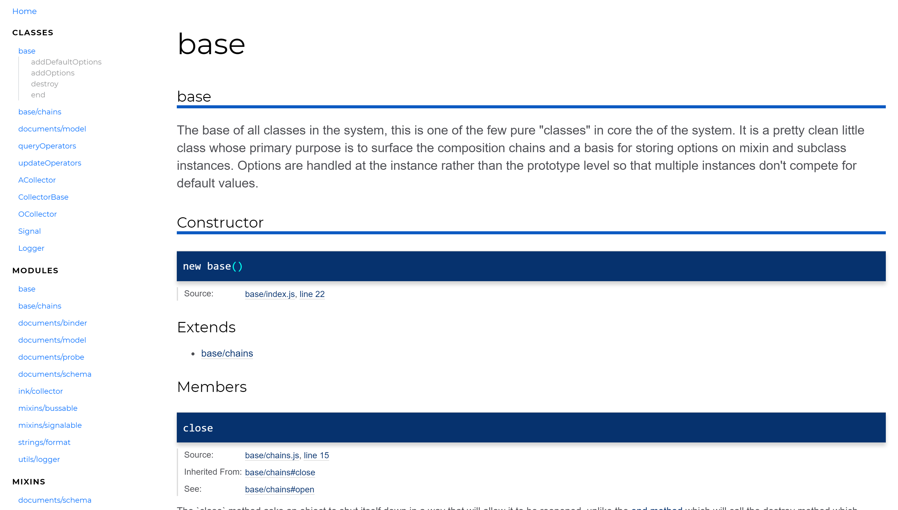

# JsDocTemplate

A template based on [Docdash](https://github.com/clenemt/docdash) by [clenemtA](https://github.com/clenemt) for [JSDoc 3](https://github.com/jsdoc3/jsdoc).



## Difference

- Different color scheme (purple => blue)
- Rewritten code to ES6
- Updated to latest version of [prettify](https://github.com/google/code-prettify) (distrib => commit b5fa4d1 on 5 Mar 2019)
- Optimized color scheme for prettify
- Minified version available

## Install

- Download this repository
- Extract the dist-folder to  "C:\Users\USERNAME\AppData\Roaming\npm\node_modules\jsdoc\templates\"
- Rename the dist-folder to "JsDocTemplate"

## Usage

```bash
$ jsdoc entry-file.js -t templates/JsDocTemplate
```

## Sample `jsdoc.json`

JsDocTemplate is based on [Docdash](https://github.com/clenemt/docdash), so it supports the same [config options](https://github.com/clenemt/docdash#sample-jsdocjson).

## Options

JsDocTemplate is based on [Docdash](https://github.com/clenemt/docdash), so it supports the same [options](https://github.com/clenemt/docdash#options).

**Important:**

The options are not stored in the "docdash"-keyword, you have to use "jsdoctemplate" instead.
